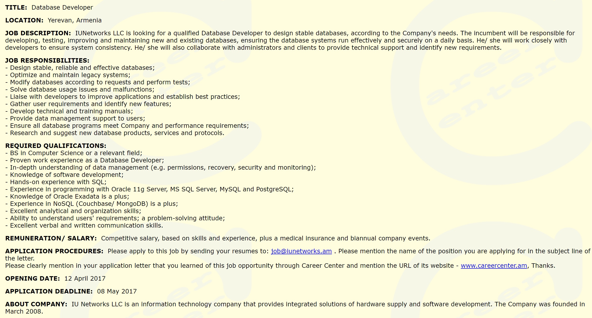

# Data Wrangling

Cleaning Data is a usefule skill that every Data Analyst should have. This is the project I used through udacity that taught me the fundamentals of cleaning data from start to finish. This dataset will review job postings from an Armenian HR website from the years 2004 - 2015.

## FILES
 - Archive.zip
 - Data-Wrangling-Project.ipynp
 
## Data Wrangling Project
- Documentation for reading zipfiles
    - [Work with ZIP archive](https://docs.python.org/3/library/zipfile.html)
 
